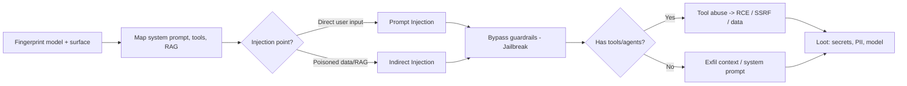

---
tags:
  - AI
icon: material/robot
---

# :material-robot: AI Hacking

> Bonus world. Models are the newest attack surface — and the one most targets
> shipped to production **without a pentest**. Same kill chain, new primitives.

LLMs, RAG pipelines, and autonomous agents are software with a probabilistic,
attacker-controllable control plane: **natural language**. That means the whole
engagement arc still applies — you just enumerate a model instead of a port, and
inject a prompt instead of a query.

-   :material-magnify-scan:{ .lg .middle } __Enumeration__

    ---
    Fingerprint the model, map the system prompt, tools, RAG sources & guardrails.

    [:octicons-arrow-right-24: AI Enumeration](enumeration.md)

-   :material-message-alert:{ .lg .middle } __Prompt Injection__ the core bug

    ---
    Direct & indirect injection — the SSRF of the AI world. Bend the model to your will.

    [:octicons-arrow-right-24: Prompt Injection](prompt-injection.md)

-   :material-lock-open-variant:{ .lg .middle } __Jailbreaks & Payloads__ library

    ---
    Copy-paste jailbreak library: roleplay, encoding, many-shot, crescendo, obfuscation.

    [:octicons-arrow-right-24: Jailbreaks & Payloads](jailbreaks.md)

-   :material-robot-industrial:{ .lg .middle } __RAG & Agent Abuse__ → RCE

    ---
    Tool-calling, function abuse, poisoned documents — where injection becomes real impact.

    [:octicons-arrow-right-24: Agent Abuse](agent-abuse.md)

-   :material-database-export:{ .lg .middle } __Post-Exploitation__

    ---
    Exfil system prompts, training data, secrets in context; pivot through agent tools.

    [:octicons-arrow-right-24: Post-Exploitation](post-exploitation.md)

-   :material-chip:{ .lg .middle } __Model & Infra Attacks__

    ---
    Extraction, membership inference, poisoning, and the ML supply chain (pickles, hubs).

    [:octicons-arrow-right-24: Model & Infra](model-infra.md)

## The AI kill chain

## Mapping to OWASP LLM Top 10

The industry-standard checklist. Every page below maps back to one or more of these.

| ID | Risk | Covered in |
|----|------|-----------|
| LLM01 | Prompt Injection | [Prompt Injection](prompt-injection.md), [Jailbreaks](jailbreaks.md) |
| LLM02 | Sensitive Information Disclosure | [Post-Exploitation](post-exploitation.md) |
| LLM03 | Supply Chain | [Model & Infra](model-infra.md) |
| LLM04 | Data & Model Poisoning | [Model & Infra](model-infra.md) |
| LLM05 | Improper Output Handling | [Agent Abuse](agent-abuse.md) |
| LLM06 | Excessive Agency | [Agent Abuse](agent-abuse.md) |
| LLM07 | System Prompt Leakage | [Enumeration](enumeration.md), [Post-Exploitation](post-exploitation.md) |
| LLM08 | Vector & Embedding Weaknesses | [Agent Abuse](agent-abuse.md) |
| LLM09 | Misinformation | [Model & Infra](model-infra.md) |
| LLM10 | Unbounded Consumption | [Model & Infra](model-infra.md) |

!!! warning "Rules of engagement"
    Only test models and applications you're authorized to assess. Jailbreak and
    injection payloads here are for **authorized red-teaming, CTFs, and research**.
    Provider ToS often restricts automated probing — get it in scope first.

## :material-link-variant: Related

- The bug that makes it real is almost always [Prompt Injection](prompt-injection.md) → [Agent Abuse](agent-abuse.md).
- When the agent has web/tool access, this collapses into classic [SSRF](../web/ssrf.md) and [Command Injection](../web/command-injection.md).
- Reference: [OWASP Top 10 for LLM Apps](https://genai.owasp.org/llm-top-10/), [MITRE ATLAS](https://atlas.mitre.org/).
