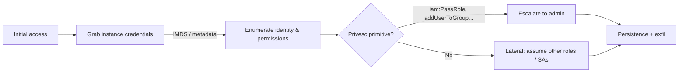

---
tags:
  - Cloud
icon: material/cloud
---

# :material-cloud: Cloud

> World 2. Same goals as on-prem — recon, credentials, privilege escalation, lateral movement — but the primitives are **IAM, metadata services, and storage**.

-   :fontawesome-brands-aws:{ .lg .middle } __AWS__

    ---
    IMDS SSRF, IAM enumeration & privesc, S3 misconfig, STS pivots.

    [:octicons-arrow-right-24: AWS](aws.md)

-   :material-microsoft-azure:{ .lg .middle } __Azure__

    ---
    Entra ID (Azure AD), managed identities, IMDS, storage & Key Vault.

    [:octicons-arrow-right-24: Azure](azure.md)

-   :material-google-cloud:{ .lg .middle } __GCP__

    ---
    Metadata tokens, service accounts, `iam.serviceAccounts.getAccessToken`, buckets.

    [:octicons-arrow-right-24: GCP](gcp.md)

## :material-format-list-bulleted-square: Full technique index

- **Providers** — [AWS](aws.md) · [Azure](azure.md) · [GCP](gcp.md)
- **Containers & Pipelines** — [Kubernetes](kubernetes.md) · [Container Escape](containers.md) · [CI/CD & Supply Chain](cicd.md)

## The cloud kill chain

## Universal first moves

- [ ] Determine which provider you're in (metadata endpoint responds? env vars? SDK config?).
- [ ] Hit the **metadata service** for temporary credentials (the #1 cloud loot source).
- [ ] Identify *who am I* (`aws sts get-caller-identity`, `az account show`, `gcloud auth list`).
- [ ] Enumerate *what can I do* before touching anything destructive.
- [ ] Look for long-lived keys in env vars, files, CI/CD variables, and IaC state.

!!! loot "Metadata is the crown jewel"
    An SSRF or a shell on a cloud VM usually leads to the **Instance Metadata Service (IMDS)**, which hands out short-lived credentials for whatever role/identity the instance runs as. That single request is often the whole ballgame — see [SSRF](../web/ssrf.md).

!!! opsec "Cloud is heavily logged"
    CloudTrail / Azure Activity Log / GCP Audit Logs record API calls. Enumeration with tools like `pacu`, `ScoutSuite`, or brute-forcing permissions is **loud**. Know your ROE.
