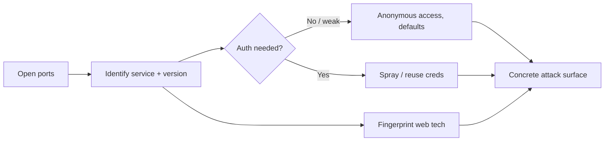

---
tags:
  - Recon
icon: material/magnify-scan
---

# :material-magnify-scan: Enumeration

> Phase 2. You found the hosts — now go deep. Turn open ports and running
> services into **versions, misconfigs, creds, and a concrete attack surface**.

-   :material-lan-connect:{ .lg .middle } __Ports & Services__

    ---
    The grab-and-go page: jump to any open port (FTP, SSH, SMB, DBs…) and run the checks.

    [:octicons-arrow-right-24: Ports & Services](../network/ports.md)

-   :material-folder-network:{ .lg .middle } __SMB & MSSQL__

    ---
    Null sessions, shares, RID cycling, and database enumeration on Windows networks.

    [:octicons-arrow-right-24: SMB](../network/smb.md) · [MSSQL](../network/mssql.md)

-   :material-application-braces:{ .lg .middle } __Web Technologies__

    ---
    Fingerprint the stack (WordPress, Jenkins, Tomcat, GitLab…) → product-specific fast paths.

    [:octicons-arrow-right-24: Web Technologies](../webtech/index.md)

-   :material-cloud-search:{ .lg .middle } __Cloud__

    ---
    Enumerate AWS, Azure, and GCP tenants — identities, storage, and exposed resources.

    [:octicons-arrow-right-24: Cloud](../cloud/index.md)

## :material-format-list-checks: The enumeration mindset

- **Version everything** — a version string is a CVE lookup away from an exploit.
- **Try nothing-first** — anonymous FTP, SMB null sessions, LDAP anon binds, and
  unauth dashboards are the fastest wins.
- **Fingerprint before you attack** — knowing it's Jenkins vs Tomcat vs WordPress
  changes the whole plan.

!!! tip "Enumeration is where engagements are won"
    Slow, thorough enumeration beats fast, sloppy exploitation every time. The bug
    is almost always in the service you didn't fully enumerate.

## :material-link-variant: Related

- Comes after [Recon](../network/recon.md); feeds [Exploitation](../web/index.md).
- Methodology aids: [Web Pentest Checklist](../checklists/web.md) · [Internal / AD Checklist](../checklists/internal-ad.md).
