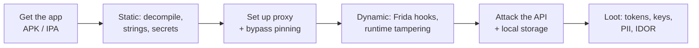

---
tags:
  - Mobile
icon: material/cellphone
---

# :material-cellphone-lock: Mobile

> The app is just a client. The real target is the **API behind it**, the
> **secrets baked into the bundle**, and the **data left on the device**.

-   :material-android:{ .lg .middle } __Android__

    ---
    Pull the APK, decompile, patch SSL pinning, hook with Frida, and attack the
    exported components.

    [:octicons-arrow-right-24: Android](android.md)

-   :material-apple-ios:{ .lg .middle } __iOS__

    ---
    Decrypt the IPA, dump class metadata, bypass jailbreak/pinning checks, and
    inspect the Keychain.

    [:octicons-arrow-right-24: iOS](ios.md)

## :material-map-marker-path: The mobile methodology

Both platforms follow the same arc — only the tooling differs:

## :material-clipboard-check: What you're always looking for

- [ ] **Hardcoded secrets** — API keys, cloud creds, signing keys in the bundle.
- [ ] **Insecure local storage** — tokens/PII in SharedPreferences, plists,
      SQLite, or world-readable files.
- [ ] **Weak transport** — no cert pinning, cleartext traffic, pinning you can
      bypass.
- [ ] **The API is the app** — most "mobile" bugs are really
      [web/API](../web/index.md) bugs (IDOR, broken auth, mass assignment).
- [ ] **Client-side trust** — jailbreak/root checks, feature flags, and price
      logic enforced only on the device.

!!! tip "The device is attacker-controlled"
    Anything the app checks locally — root/jailbreak detection, SSL pinning,
    "premium" flags — you can patch or hook out. Treat every client-side control
    as advisory and re-test the server without it.

## :material-tools: Baseline toolkit

| Job | Android | iOS |
| --- | --- | --- |
| Pull the app | `adb` / APKPure | `frida-ios-dump`, Apple Configurator |
| Decompile | `jadx`, `apktool` | `Hopper`, `Ghidra`, `class-dump` |
| Runtime instrumentation | **Frida**, Objection | **Frida**, Objection |
| Proxy | Burp + system CA | Burp + profile CA |
| Storage | `adb shell`, `run-as` | `Filza`, SSH over USB |

## :material-link-variant: Related

- The payoff is almost always an [API / web](../web/index.md) attack surface —
  once you see the traffic, hunt [Auth Bypass](../web/auth-bypass.md),
  [JWT](../web/jwt.md), and [SQLi](../web/sqli.md).
- Backend often runs in the [Cloud](../cloud/index.md) — leaked keys pivot there.
- Reference: [OWASP MASTG](https://mas.owasp.org/MASTG/),
  [OWASP MASVS](https://mas.owasp.org/MASVS/).
