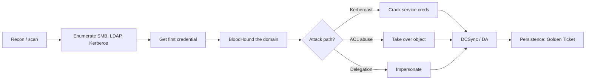

---
tags:
  - Network
icon: material/lan
---

# :material-lan: Network / Active Directory

> World 3. Internal networks and Active Directory. The game here is *foothold → credentials → lateral movement → Domain Admin*.

-   :material-radar:{ .lg .middle } __Recon__

    ---
    Host discovery, port scanning, service enumeration, and finding the soft targets.

    [:octicons-arrow-right-24: Recon](recon.md)

-   :material-folder-network:{ .lg .middle } __SMB__

    ---
    Shares, null sessions, RID cycling, and lateral movement over 445.

    [:octicons-arrow-right-24: SMB](smb.md)

-   :material-ticket-account:{ .lg .middle } __Kerberos__

    ---
    Roasting, delegation abuse, ticket forgery.

    [:octicons-arrow-right-24: Kerberos](kerberos.md)

-   :material-sitemap:{ .lg .middle } __Active Directory__

    ---
    BloodHound, ACL abuse, DCSync, and end-to-end attack paths.

    [:octicons-arrow-right-24: Active Directory](active-directory.md)

## :material-format-list-bulleted-square: Full technique index

- **Recon** — [Recon](recon.md) · [DNS](dns.md)
- **Services** — [SMB](smb.md) · [MSSQL](mssql.md)
- **Active Directory** — [Kerberos](kerberos.md) · [Active Directory](active-directory.md) · [Coercion & NTLM Relay](ntlm-relay.md) · [AD CS (ESC)](adcs.md) · [Password Spraying](password-spraying.md) · [BloodHound](bloodhound.md)

## Internal engagement flow

## Domain-joined checklist

- [ ] Identify the domain, DCs, and your current context (`nltest`, `whoami /all`).
- [ ] Scan for the usual suspects: 88 (Kerberos), 389/636 (LDAP), 445 (SMB), 5985 (WinRM).
- [ ] Collect BloodHound data early — it turns guesswork into a graph.
- [ ] Spray/roast for a first credential if you have none.
- [ ] Always ask BloodHound "shortest path to Domain Admins" from what you own.

!!! tip "Impacket + NetExec are the workhorses"
    Most of this section uses [Impacket](https://github.com/fortra/impacket) scripts and [NetExec](https://github.com/Pennyw0rth/NetExec) (the maintained successor to CrackMapExec). Install both before you start.
