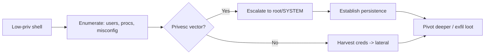

---
tags:
  - Privesc
icon: material/key-chain
---

# :material-key-chain: Privesc & Post-Exploitation

> World 4. You have a shell. Now turn a low-priv foothold into full control, then keep it and use it.

<div class="grid cards" markdown>

-   :material-linux:{ .lg .middle } __Linux Privesc__

    ---
    SUID, sudo, capabilities, cron, kernel, and misconfig hunting.

    [:octicons-arrow-right-24: Linux](linux.md)

-   :material-microsoft-windows:{ .lg .middle } __Windows Privesc__

    ---
    Tokens, services, unquoted paths, AlwaysInstallElevated, potatoes.

    [:octicons-arrow-right-24: Windows](windows.md)

-   :material-anchor:{ .lg .middle } __Persistence__

    ---
    Staying resident on Linux & Windows across reboots.

    [:octicons-arrow-right-24: Persistence](persistence.md)

-   :material-transit-connection-variant:{ .lg .middle } __Pivoting & Exfil__

    ---
    Tunnels, port forwards, SOCKS proxies, and getting data out.

    [:octicons-arrow-right-24: Pivoting](pivoting.md)

</div>

## :material-format-list-bulleted-square: Full technique index

- **Linux** — [Linux Privesc](linux.md) · [GTFOBins & SUID](gtfobins.md)
- **Windows** — [Windows Privesc](windows.md) · [Token & Privilege Abuse](windows-tokens.md)
- **Post-Exploitation** — [Credential Hunting](credential-hunting.md) · [Persistence](persistence.md) · [Pivoting & Exfil](pivoting.md)

## Post-foothold flow



## Always-run enumeration

=== "Linux"

    ```bash
    id; sudo -l; uname -a
    # Automated:
    ./linpeas.sh -a | tee linpeas.txt
    ```

=== "Windows"

    ```powershell
    whoami /all
    # Automated:
    .\winPEASx64.exe
    ```

!!! tip "Enumerate before you exploit"
    90% of privesc is **finding** the misconfig, not exploiting it. Run the PEAS scripts, read the output slowly, and cross-reference [GTFOBins](https://gtfobins.github.io/) / [LOLBAS](https://lolbas-project.github.io/).
