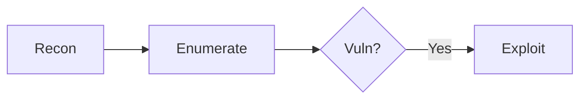

---
tags:
  - Reference
---

# :material-format-text: Page Formatting

<span class="pill pill-info">authoring</span> <span class="pill pill-easy">reference</span>

Every formatting element this site supports, with the **source on the left** and
the **actual rendered result on the right**. Copy the left, get the right.

!!! abstract "TL;DR"
    Callouts carry the insight, tabs carry per-OS/per-context variants, fenced
    `bash` blocks auto-highlight their flags, and pills tag a page's difficulty at
    a glance. Everything below is already enabled — no config needed.

## :material-format-header-pound: Headings & text

<div class="grid" markdown>

<div markdown>
````markdown
## Section heading
### Sub-heading

**bold**, *italic*, `inline code`,
~~strikethrough~~, ==highlight==,
^^insert^^, ~sub~ and ^sup^.
````
</div>

<div markdown>
**bold**, *italic*, `inline code`,
~~strikethrough~~, ==highlight==,
^^insert^^, ~sub~ and ^sup^.
</div>

</div>

!!! tip "Heading convention on this site"
    Page title is a single `#` with an icon. Sections are `##` **with an icon**,
    sub-sections are plain `###`. Every page ends with
    `## :material-link-variant: Related`.

## :material-format-list-bulleted: Lists

<div class="grid" markdown>

<div markdown>
````markdown
- bullet
- another
    - nested (4 spaces)

1. numbered
2. second

- [ ] task, unticked
- [x] task, done
````
</div>

<div markdown>
- bullet
- another
    - nested (4 spaces)

1. numbered
2. second

- [ ] task, unticked
- [x] task, done
</div>

</div>

## :material-alert-circle: Callouts (admonitions)

The workhorse. `!!!` for an always-open callout, `???` for collapsed,
`???+` for collapsible-but-open.

<div class="grid" markdown>

<div markdown>
````markdown
!!! tip "Optional title"
    Body is indented 4 spaces.
````
</div>

<div markdown>
!!! tip "Optional title"
    Body is indented 4 spaces.
</div>

</div>

<div class="grid" markdown>

<div markdown>
````markdown
??? example "Click to expand"
    Hidden until clicked.
````
</div>

<div markdown>
??? example "Click to expand"
    Hidden until clicked.
</div>

</div>

### Every type available here

Two of these are **custom to this site** — `loot` and `opsec`.

<div class="grid" markdown>

<div markdown>
````markdown
!!! loot "loot — what you walk away with"
    Custom. Credentials, hashes, tokens.
````
</div>

<div markdown>
!!! loot "loot — what you walk away with"
    Custom. Credentials, hashes, tokens.
</div>

</div>

<div class="grid" markdown>

<div markdown>
````markdown
!!! opsec "opsec — noise & detection"
    Custom. What this trips.
````
</div>

<div markdown>
!!! opsec "opsec — noise & detection"
    Custom. What this trips.
</div>

</div>

<div class="grid" markdown>

<div markdown>
````markdown
!!! abstract "abstract — the TL;DR"
    Used at the top of most pages.
````
</div>

<div markdown>
!!! abstract "abstract — the TL;DR"
    Used at the top of most pages.
</div>

</div>

<div class="grid" markdown>

<div markdown>
````markdown
!!! bug "bug — gotcha that bites you"
    Broken behaviour, footguns.
````
</div>

<div markdown>
!!! bug "bug — gotcha that bites you"
    Broken behaviour, footguns.
</div>

</div>

<div class="grid" markdown>

<div markdown>
````markdown
!!! warning "warning"
    Proceed carefully.
````
</div>

<div markdown>
!!! warning "warning"
    Proceed carefully.
</div>

</div>

<div class="grid" markdown>

<div markdown>
````markdown
!!! danger "danger"
    Destructive / high blast radius.
````
</div>

<div markdown>
!!! danger "danger"
    Destructive / high blast radius.
</div>

</div>

The rest of the stock set works too: `note`, `info`, `success`, `question`,
`failure`, `example`, `quote`. Omit the title (`!!! note`) to use the type name;
use `!!! note ""` for no title bar at all.

## :material-tab: Tabs

For per-OS, per-shell or per-context variants of the same step.

<div class="grid" markdown>

<div markdown>
````markdown
=== "Linux"

    ```bash
    id; sudo -l
    ```

=== "Windows"

    ```powershell
    whoami /all
    ```
````
</div>

<div markdown>
=== "Linux"

    ```bash
    id; sudo -l
    ```

=== "Windows"

    ```powershell
    whoami /all
    ```
</div>

</div>

!!! bug "Never put a raw HTML tag in a tab title"
    `=== "Inside <script>"` opens a **real script tag** and silently swallows the
    rest of the page. Always backtick it: `` === "Inside `<script>`" ``. This bit
    this site once — the whole lower half of a page vanished.

## :material-code-braces: Code blocks

<div class="grid" markdown>

<div markdown>
````markdown
```bash
nmap -sV --top-ports 100 $TARGET
```
````
</div>

<div markdown>
```bash
nmap -sV --top-ports 100 $TARGET
```
</div>

</div>

!!! loot "`bash` fences auto-highlight their flags"
    A build hook colours flags (`-sV`, `--top-ports`) and arguments in any
    `bash`/`sh`/`shell`/`zsh` fence — no markup needed. Use `text` instead when
    you want output pasted verbatim with no colouring.

Extras: add a title with `title="..."`, highlight lines with `hl_lines="2 3"`,
and use `` `#!python print()` `` for inline syntax-highlighted code.

<div class="grid" markdown>

<div markdown>
````markdown
```python title="exploit.py" hl_lines="2"
import requests
requests.get(URL)   # highlighted
```
````
</div>

<div markdown>
```python title="exploit.py" hl_lines="2"
import requests
requests.get(URL)   # highlighted
```
</div>

</div>

## :material-table: Tables

<div class="grid" markdown>

<div markdown>
````markdown
| Port | Service | Note |
| --- | --- | --- |
| 445 | SMB | null session |
| 3389 | RDP | NLA check |
````
</div>

<div markdown>
| Port | Service | Note |
| --- | --- | --- |
| 445 | SMB | null session |
| 3389 | RDP | NLA check |
</div>

</div>

Align with `:---`, `:---:`, `---:` in the separator row.

## :material-view-grid: Side-by-side layout (grid)

Wrap blocks in `<div class="grid" markdown>` to lay them out in columns. Each
child needs its own `<div markdown>`. Collapses to one column on narrow screens.
Note the **blank line** after each opening tag — without it the markdown inside
won't render.

````markdown
<div class="grid" markdown>

<div markdown>
**Left column**

| Flag | Does |
| --- | --- |
| `-fs` | filter by size |
</div>

<div markdown>
**Right column**

| Flag | Does |
| --- | --- |
| `-mc` | match codes |
</div>

</div>
````

Renders as:

<div class="grid" markdown>

<div markdown>
**Left column**

| Flag | Does |
| --- | --- |
| `-fs` | filter by size |
</div>

<div markdown>
**Right column**

| Flag | Does |
| --- | --- |
| `-mc` | match codes |
</div>

</div>

### Grid cards

Add `cards` for the boxed look used on section index pages.

````markdown
<div class="grid cards" markdown>

-   :material-database-arrow-right:{ .lg .middle } __SQL Injection__ <span class="pill pill-hard">high impact</span>

    ---
    Read the database, dump creds, sometimes RCE.

    [:octicons-arrow-right-24: SQLi](../web/sqli.md)

</div>
````

<div class="grid cards" markdown>

-   :material-database-arrow-right:{ .lg .middle } __SQL Injection__ <span class="pill pill-hard">high impact</span>

    ---
    Read the database, dump creds, sometimes RCE.

    [:octicons-arrow-right-24: SQLi](../web/sqli.md)

</div>

## :material-label: Pills

The little tags under a page title. Four variants are defined — anything else
renders unstyled.

<div class="grid" markdown>

<div markdown>
````markdown
<span class="pill pill-easy">easy</span>
<span class="pill pill-medium">common</span>
<span class="pill pill-hard">high impact</span>
<span class="pill pill-info">web</span>
````
</div>

<div markdown>
<span class="pill pill-easy">easy</span>
<span class="pill pill-medium">common</span>
<span class="pill pill-hard">high impact</span>
<span class="pill pill-info">web</span>
</div>

</div>

## :material-graph: Diagrams (mermaid)

<div class="grid" markdown>

<div markdown>
````markdown

````
</div>

<div markdown>

</div>

</div>

## :material-emoticon: Icons, emoji & keys

Icons come from four sets: `material`, `simple` (brands), `fontawesome`,
`octicons`. Size/align them with `{ .lg .middle }`.

<div class="grid" markdown>

<div markdown>
````markdown
:material-skull-crossbones: :simple-jenkins:
:octicons-arrow-right-24: :fontawesome-brands-github:
:material-fire:{ .lg .middle } and ++ctrl+alt+del++
````
</div>

<div markdown>
:material-skull-crossbones: :simple-jenkins:
:octicons-arrow-right-24: :fontawesome-brands-github:
:material-fire:{ .lg .middle } and ++ctrl+alt+del++
</div>

</div>

!!! bug "An invalid icon name renders as literal text"
    `--strict` will **not** catch it. Brand logos live in `simple`, not
    `material`: `:simple-jenkins:` works, `:material-jenkins:` prints as raw text.
    Check the name exists before shipping.

## :material-link: Links, footnotes & abbreviations

Internal links are **relative paths to the `.md` file** — `--strict` fails the
build on a broken one, which is how dead links get caught.

<div class="grid" markdown>

<div markdown>
````markdown
[SQLi](../web/sqli.md) ·
[a section](#tables) ·
[external](https://portswigger.net)

A claim needing a source.[^1]

[^1]: The footnote text.

The *[DC]* expands on hover.

*[DC]: Domain Controller
````
</div>

<div markdown>
[SQLi](../web/sqli.md) ·
[a section](#tables) ·
[external](https://portswigger.net)

A claim needing a source.[^1]

[^1]: The footnote text.

The *[DC]* expands on hover.

*[DC]: Domain Controller
</div>

</div>

## :material-format-quote-close: Quotes, definitions & edits

<div class="grid" markdown>

<div markdown>
````markdown
> A blockquote.

Term
:   Its definition.

{--deleted--} {++added++} {~~old~>new~~}
````
</div>

<div markdown>
> A blockquote.

Term
:   Its definition.

{--deleted--} {++added++} {~~old~>new~~}
</div>

</div>

## :material-file-document-outline: Page skeleton

The shape every note on this site follows:

````markdown
---
tags:
  - Web
---

# :material-spider-web: Page Title

<span class="pill pill-hard">high impact</span> <span class="pill pill-info">web</span>

One or two sentences on what this is and why it matters.

!!! abstract "TL;DR"
    The whole technique in two lines.

## :material-magnify: Detect

## :material-code-tags: Exploit

## :material-alert-decagram: Edge cases & gotchas

## :material-link-variant: Related

- Sibling technique → [XSS](../web/xss.md).
- Reference: [PortSwigger](https://portswigger.net/web-security).
````

!!! tip "Conventions worth keeping"
    - `$TARGET` for the victim host, `$ATTACKER` for your own listener — never
      a real hostname or a client's.
    - Payloads go in fences **byte-exact**; never reflow or "clean up" one.
    - No Remediation sections — this site is offensive-only.

## :material-link-variant: Related

- Build config lives in `mkdocs.yml`; styling in `docs/stylesheets/extra.css`.
- Reference: [Material reference](https://squidfunk.github.io/mkdocs-material/reference/) ·
  [PyMdown extensions](https://facelessuser.github.io/pymdown-extensions/).
