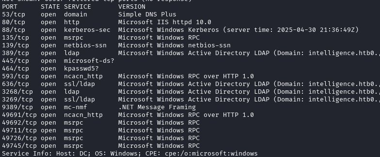

---
tags:
  - Reference
---

# :material-microsoft-windows: Intelligence

intelligence.htb ad

**Notes are thin — initial scan only** — my own notes, translated.

!!! warning "Full solution ahead"
    This is a complete walkthrough with working credentials. Retired machine.

Only the initial scan was recorded. Domain `intelligence.htb`; nmap shows a DC
with 53 (Simple DNS Plus), 80 (IIS 10.0), 88, 135/139/445, 389/636/3268/3269
LDAP, 464, 593, 9389 (.NET Message Framing) and the usual high RPC ports.

*nmap — a DC: DNS, IIS 10.0, Kerberos, LDAP, ADWS*

The rest of the path is in the curated entry above.

## :material-link-variant: Related

- Back to the index → [HTB Writeups](../htb.md).
