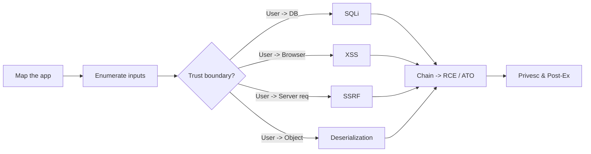

---
tags:
  - Web
icon: material/spider-web
---

# :material-spider-web: Web Apps

> World 1. If you can only learn one attack surface, learn this one — almost every target has a web front door.

-   :material-database-arrow-right:{ .lg .middle } __SQL Injection__ high impact

    ---
    Read/modify the database, dump creds, sometimes get RCE.

    [:octicons-arrow-right-24: SQLi](sqli.md)

-   :material-language-javascript:{ .lg .middle } __Cross-Site Scripting__ common

    ---
    Run JS in a victim's session — steal cookies, pivot to account takeover.

    [:octicons-arrow-right-24: XSS](xss.md)

-   :material-server-network:{ .lg .middle } __SSRF__ cloud killer

    ---
    Make the server request things it shouldn't — often the road into cloud metadata.

    [:octicons-arrow-right-24: SSRF](ssrf.md)

-   :material-account-lock-open:{ .lg .middle } __Auth Bypass__ everywhere

    ---
    IDOR, JWT flaws, broken resets, and logic bugs that skip the login.

    [:octicons-arrow-right-24: Auth Bypass](auth-bypass.md)

-   :material-file-upload:{ .lg .middle } __File Upload__ → RCE

    ---
    Turn an upload form into a webshell.

    [:octicons-arrow-right-24: File Upload](file-upload.md)

-   :material-package-variant-closed:{ .lg .middle } __Deserialization__ gadget chains

    ---
    Untrusted objects → arbitrary code execution.

    [:octicons-arrow-right-24: Deserialization](deserialization.md)

## :material-format-list-bulleted-square: Full technique index

The cards above are the headliners — here's everything in World 1, grouped by where the bug lives:

- **Injection** — [SQLi](sqli.md) · [NoSQL](nosql-injection.md) · [Command](command-injection.md) · [LDAP](ldap-injection.md) · [XXE](xxe.md) · [SSTI](ssti.md) · [GraphQL](graphql.md)
- **Auth & Sessions** — [Auth Bypass](auth-bypass.md) · [JWT Attacks](jwt.md) · [OAuth & SAML](oauth-saml.md)
- **Client-Side** — [XSS](xss.md) · [CSRF](csrf.md) · [CORS](cors.md) · [Clickjacking](clickjacking.md) · [Prototype Pollution](prototype-pollution.md)
- **Server-Side** — [SSRF](ssrf.md) · [File Upload](file-upload.md) · [Deserialization](deserialization.md) · [Open Redirect](open-redirect.md) · [Request Smuggling](request-smuggling.md) · [Cache Poisoning](web-cache-poisoning.md) · [Race Conditions](race-conditions.md)

## Methodology at a glance

## First 15 minutes on any web target

- [ ] Fingerprint the stack (`whatweb`, `wappalyzer`, response headers, cookies).
- [ ] Spider + content discovery (`feroxbuster`, `ffuf`) for hidden endpoints.
- [ ] Grab `robots.txt`, `sitemap.xml`, `/.git/`, `/.env`, backup files.
- [ ] Map every input: query params, POST bodies, headers, cookies, JSON fields.
- [ ] Identify auth model (session cookie? JWT? OAuth?) and roles.
- [ ] Note the framework — it dictates which class of bug is likely.

!!! tip "Burp Suite is your controller"
    Proxy the app through Burp (or Caido / ZAP) from minute one. Every technique below assumes you can see and replay requests.
